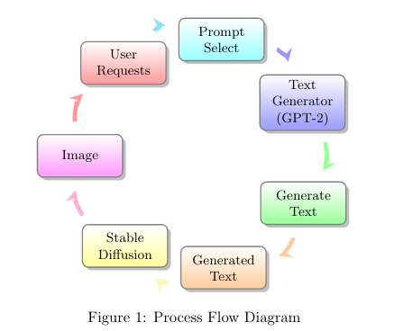

## Django Template
# Django REST Server - Image Generation

This Django REST server provides an API endpoint for generating images that are generated randomly by using gpt2 to generate prompts and stablediffusion to generate images based on the generated prompts.

## Process Flow

This diagram visually represents the flow of the process:




1. **User Requests:** The user initiates a request for image generation.
2. **Text Generator (GPT-2) - Hugging Face Inference API:** The request is sent to the text generator using the Hugging Face Inference API.
3. **Select Prompt:** A prompt is selected from a dictionary of 30 prompts to be used for text generation.
4. **Generate Text:** The text generator generates text based on the selected prompt.
5. **Generated Text:** The generated text is obtained.
6. **Stable Diffusion:** The generated text is used as input for Stable Diffusion, a process that produces an image.
7. **Image:** The resulting image is generated.
8. The cycle continues as the user can make subsequent requests.

## Prerequisites

- Python 3.x
- Django
- Django REST Framework

## Installation, entrypoint and results

1. Clone the repository:

   ```bash
   git clone https://github.com/your-username/django-rest-server.git
2. Create a virtual environment
   ```bash
   python -m venv <nameofvirtualenv>
3. Activate virtual environment
   ```bash
   source <nameofvirtualenv>/bin/activate

4. Install dependencies:
    ```bash
    pip install -r requirements.txt
5. Modify the database settings in settings.py to use SQLite3 or your custom database.

6. Apply database migrations:
   ```bash
   python manage.py migrate
7. Start the development server:
   ```bash
   python manage.py runserver


## 8. Available as an api endpoint at https://django-rest-image-generation-production.up.railway.app/apis/generate-image/
## 9.  A generated image:

   
   [](https://railway.app/new/template/GB6Eki?referralCode=U5zXSw)

